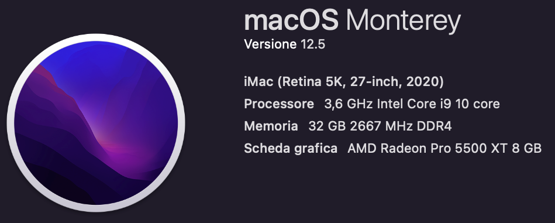

<p>
    <div align="center">
        <h1> AI Watch B1 </h1>
    </div>
    <div align="justify">
        <h3> AI Watch B1 is a module of the AiWatch project that includes the implementation of the digital twin and software for detecting outliers on an infinite data stream. Eclipse Ditto receives the coordinates from the Ai Watch A1 module, updates the digital twin and send them to the Streaming Anomaly Detector. This software sends the coordinates with the "anomaly_value" flag to the Ai Watch C1 (Unity 3D) module.
        </h3>
    </div>
    <div align="center">
        
    </div>
    
</p>


## Demo AI WATCH 💻
- [Video Unity and anomaly (when avatar color = red) output] 

https://user-images.githubusercontent.com/31493347/199800246-85cfb2e8-0283-4eac-b568-9901ea64f1b0.mp4

Anomaly result values shown in the video:
<p>
    <div align="center">
        
    </div>
</p>


## System Structure 🏛
<p>
    <div align="center">
        
    </div>
</p>


## Docs 📜
- AI Watch B1 documentation was generated using [Doxygen](https://doxygen.nl/)


## Installation 🚀
this AiWatch module includes two main software: Eclipse Ditto (implementation of Digital Twin) and Streaming Anomaly Detector, so the installation and setup is divided into two parts to be followed in the following order:
***
1. **[SETUP/RUN Apache Kafka and Eclipse Ditto](https://github.com/Luruu/AI_Watch_B1/blob/main/ditto_kafka/README.md#setup-eclipse-ditto-and-apache-kafka)** and **[SETUP ECLIPSE DITTO FOR AIWATCH PROJECT](https://github.com/Luruu/AI_Watch_B1/blob/main/ditto_kafka/commands/README.md#setup-eclipse-ditto-for-aiwatch-project)**
3. **[SETUP/RUN Streaming Anomaly Detector](https://github.com/Luruu/AI_Watch_B1/blob/main/anomaly-detection/README.md#setup-streaming-anomaly-detector)**
***

The system was mainly used on the following hardware:
<p>
    <div align="center">
        
    </div>
</p>
But a test was also carried out correctly on ubuntu 20.4 LTS. <b>Instead I do not recommend using Mac computers with M1 or M2 processor for the first test<b>.


## Tools 🛠
- [Eclipse Ditto](https://www.eclipse.org/ditto/)
- [Kafka](https://kafka.apache.org/)
- [Python Confluent Kafka library](https://github.com/confluentinc/confluent-kafka-python)
- [Confluent](https://www.confluent.io/)
- [Doxygen](https://doxygen.nl/)
- [Docker](https://www.docker.com/)
- [Docker-Compose](https://docs.docker.com/compose/)
- [PySAD](https://pysad.readthedocs.io/en/latest/)
- [PyNomaly](https://github.com/vc1492a/PyNomaly)


## License ☢️
AI Watch B1 is licensed under the Apache License, Version 2.0. Copyright 2022. Please, see the [license](https://github.com/Luruu/AI_Watch_B1/blob/main/LICENSE).


## Contacts 🪪
- [mail] luca [ dot ] rubino001 [ at ] studenti [ dot ] uniparthenope [ dot ] it (you can write to me in english or italian).


## Citation 📖
```
    @report{AIWatchB1,
        author = {Luca Rubino},
        title = {Streaming anomaly detection on streaming data given by Digital Twin through Eclipse Ditto using Apache Kafka​},
        institution = {University of Naples, Parthenope},
        year = {2022}
    }
```

## Supervisor
- [Dr. Alessio Ferone](https://www.researchgate.net/profile/Alessio-Ferone), CS Assistant Professor at the [University of Naples Parthenope](https://www.uniparthenope.it/).


## Other modules
- [A1 - Tracker](https://github.com/dennewbie/AI_Watch_A1)
- [C1 - Unity3D](https://github.com/RenatoEsposito1999/AIWatch)

a.a. 2021/2022

