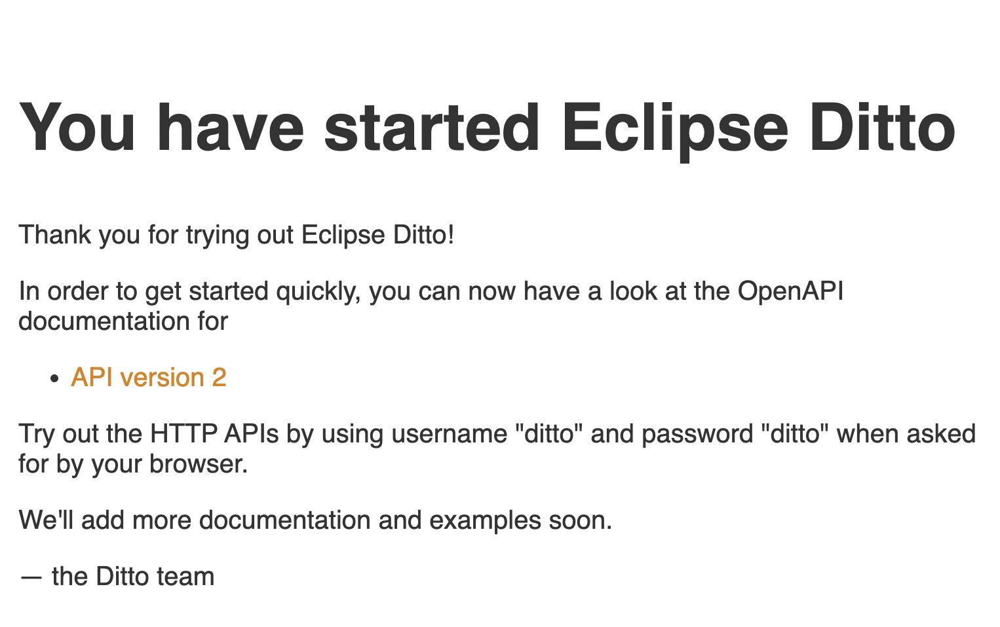

# SETUP ECLIPSE DITTO AND APACHE KAFKA

## SOFTWARE
- [**Eclipse Ditto v 2.4**](https://www.eclipse.org/ditto/): is a technology in the IoT implementing a software pattern called “digital twins”.
- [**Apache Kafka v latest**](https://kafka.apache.org/): is an open-source distributed event streaming platform for high-performance data pipelines, streaming analytics, data integration, and mission-critical applications.
-  [**Docker-compose (or Docker Desktop)**](https://docs.docker.com/compose/): docker-compose is a tool for defining and running multi-container Docker applications. With Compose, you use a YAML file to configure your application’s services. Then, with a single command, you create and start all the services from your configuration.
 
This module uses:
- Eclipse Ditto to implement digital twin.
- Apache Kafka as the communication technology between the software entities of the project ([see system architecture](https://github.com/Luruu/AI_Watch_B1#system-structure-)).
- docker-compose to start all Ditto and Kafka services.

## Note
1. Apache Kafka and Eclipse Ditto are open source software. So you can download, configure and install these software in several ways. In my case, I have decided to use docker for both. This repository contains all the software you need but I recommend using the latest available version of Eclipse Ditto after doing the next full system test.
2. Each module of the AiWatch project makes use of different software. So if you are following the instructions on a personal computer, check the requirements of each software on the developers websites.

## [OPTIONAL] Alternative setup
- Eclipse Ditto alternative setup: Ditto can be installed in several ways, just [check here](https://github.com/eclipse-ditto/ditto/tree/master/deployment#eclipse-ditto--deployment).
- Apache Kafka alternative setup: if you want do by yourself, you can download apache kafka from [official website](https://kafka.apache.org/downloads).

 
## SETUP (Ditto and Kafka)
1. Download and install Docker Desktop or Docker-Compose (docker desktop contains docker compose) [following this istructions](https://docs.docker.com/compose/install/).
2. Clone this repository locally, go in `AI_Watch_B1` directory and use this following command: 
```bash
cd ditto_kafka/docker/
```
3. Create and start Ditto and Kafka containers
```bash
docker-compose up -d
```
[Optional] Check the logs after starting up:
```bash
docker-compose logs -f
```
Now the containers have been created and are running, but if you want to stop or delete them or whatever, you can see the [docker-compose documentation](https://docs.docker.com/compose/reference/).


## RUN Eclipse Ditto and Apache Kafka containers
- If you only use Docker-compose: the containers are always active and when the computer starts up automatically if they have not been turned off or if there are no problems.
- If you are using Docker-desktop: open docker-desktop and the containers will start automatically.

## Is ECLIPSE DITTO Running?
Open following URL: [http://localhost:8080](http://localhost:8080)<br/>
<p>
    <div align="center">
        
    </div>
</p>
If you can see welcome message of Eclipse Ditto, you started Eclipse Ditto correctly.

## Is APACHE KAFKA Running? 
If Ditto is working correctly then it is very likely that kafka is working too. But, if you want to be sure, then you need to create a kafka topic and use a consumer and a producer to test. To do this you can directly follow the following steps:

- RUN KAFKA CONSUMER ISTANCE
1. open a new terminal
2. show running containers and copy on notepad the **kafka container id**: 
```bash 
sudo docker ps
```
3. use sh to use kafka container:  
```bash 
docker exec -it <PUT HERE KAFKA CONTAINER ID> sh
``` 
4. run a **kafka consumer istance**: 
```bash 
kafka-console-consumer --bootstrap-server <PUT_YOUR_IP (NOT LOCALHOST or 127.0.0.1)>:29092 --topic topic1
```
don't worry about warnings/error: you created topic1 implicitly. 

- RUN KAFKA PRODUCER ISTANCE
1. open a new terminal
2. use sh to use kafka container:  
```bash 
docker exec -it <PUT HERE KAFKA CONTAINER ID COPIED BEFORE> sh
``` 
4. run a **kafka consumer istance**: 
```bash 
kafka-console-producer --bootstrap-server <PUT_YOUR_IP (NOT LOCALHOST or 127.0.0.1)>:29092 --topic topic1
```

Write a message in this terminal (hit enter of course). If you can see the message in the terminal where the consumer instance is running, then apache kafka is working fine.

## WHICH PORT USE APACHE KAFKA IN AIWATCH PROJECT?
The port used by Kafka for the other services is port ```29092```, so you so you don't have to use the default port which is shown in the apache kafka official site tutorial!!


